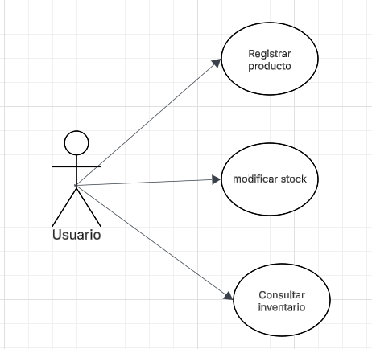
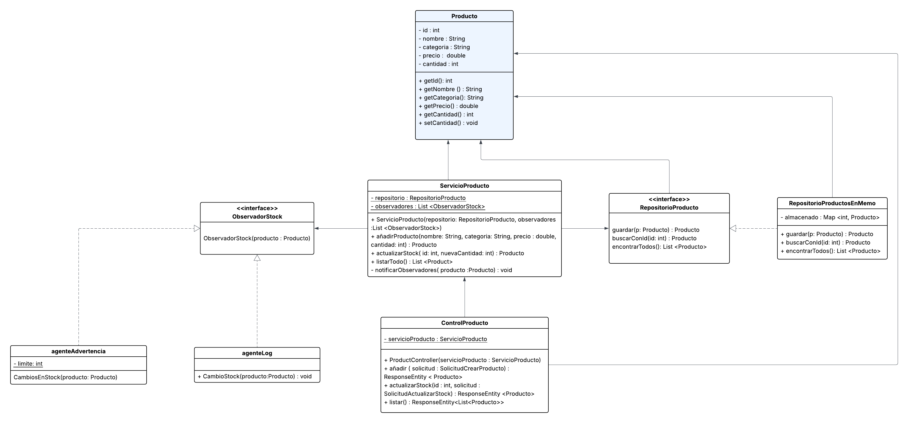

## Taller evaluativo primer tercio DOSW
### Carolina Cepeda Valencia
___
## Tecnologías usadas:
* Java 17
*  Spring Boot 3.2
* Maven 3.9
* Junit 5

## Análisis de requerimientos
____

* Añadir productos al sistema
* Modificar Stock de productos
* Notificar los cambios a agentes log y advertencia.

## Diseño del sistema
___
### Diagramas

#### Diagrama de contexto

#### Diagrama de casos de uso

Basado en los requerimientos, se observan los siguientes casos de uso:

#### Diagrama de clases
Se toma como clase principal al producto, ya que el sistema
gira en torno a la gestión de estos. Se usa a ServicioProducto como el
contenedor de la lógica del negocio - añadir producto, actualizar stock, listar todo-
que tiene una referencia a RepositorioProducto para guardar y consultar datos, también tiene una
lista de observadores de cada producto (ObservadorStock) y se notifica
a los observadores cuando el stock cambia.

Se maneja el almacenamiento de datos con la interfaz
RepositorioProducto que define las operaciones básicas (guardar, buscarConId,encontrarTodos)
y se implementa en la clase RepositorioProductosEnMemoria usando un Map para mantener
dividida la lógica del sistema del almacenamiento.

Se hace uso de ObservadorStock como interfaz que define
el método cambiosEnStock(producto) que en sus implementaciones muestra
mensajes en consola dependiendo de ciertas condiciones; para la implementación
AgenteLog escribe en consola cada cambio en el stock, mientras que, AgenteAdvertencia
lanza una alerta si la cantidad baja de un límite.

#### Patrones aplicados
Se aplica el patrón es Observer porque el sistema
notifica a los observadores del Stock (StockObserver) cuando cambia
el Stock. A su vez, se usa Repository para acceder a datos de forma desacoplada ( y no
dependan de la implementación actual) y se usan DTOs para transportar los datos en la API.

#### Principios SOLID
* **S**: cada clase tiene una sola responsabilidad
* **O**: El sistema permite extender, por ejemplo, nuevos observadores
sin tener que modificar las clases ya existentes.
* **L**: Las implementaciones, como RepositorioProductosEnMemoria, respetan
contratos ( RepositorioProducto).
* **I**: Se hace uso de interfaces pequeñas y específicas (ObservadorStock, RepositorioProducto)
* **D**: El servicio depende de las abstracciones ( y no de implementaciones concretas.

## Uso del sistema por el usuario
___