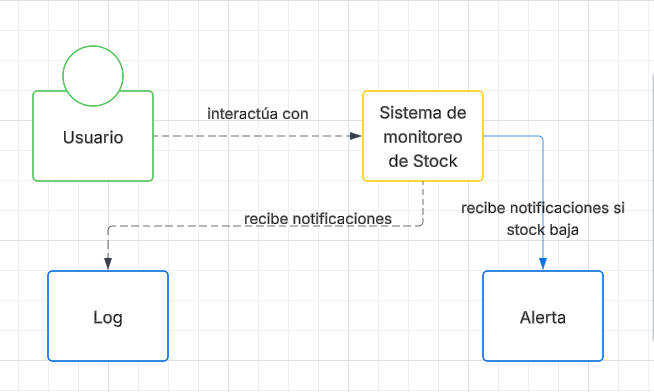
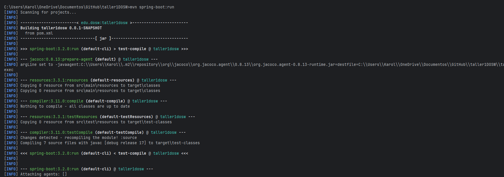

## Taller evaluativo primer tercio DOSW
### Carolina Cepeda Valencia
___
## Tecnologías usadas:
* Java 17
* Spring Boot 3.2
* Maven 3.9
* Junit 5
* Sonarqube

## Análisis de requerimientos
____

* Añadir productos al sistema
* Modificar Stock de productos
* Notificar los cambios a agentes log y advertencia.

## Plan de trabajo
EPIC: Gestión de inventario y notificaciones de stock

## Diseño del sistema
___
### Diagramas

#### Diagrama de contexto

#### Diagrama de casos de uso

Basado en los requerimientos, se observan los siguientes casos de uso:

#### Diagrama de clases
Se toma como clase principal al producto, ya que el sistema
gira en torno a la gestión de estos. Se usa a ServicioProducto como el
contenedor de la lógica del negocio - añadir producto, actualizar stock, listar todo-
que tiene una referencia a RepositorioProducto para guardar y consultar datos, también tiene una
lista de observadores de cada producto (ObservadorStock) y se notifica
a los observadores cuando el stock cambia.

Se maneja el almacenamiento de datos con la interfaz
RepositorioProducto que define las operaciones básicas (guardar, buscarConId,encontrarTodos)
y se implementa en la clase RepositorioProductosEnMemoria usando un Map para mantener
dividida la lógica del sistema del almacenamiento.

Se hace uso de ObservadorStock como interfaz que define
el método cambiosEnStock(producto) que en sus implementaciones muestra
mensajes en consola dependiendo de ciertas condiciones; para la implementación
AgenteLog escribe en consola cada cambio en el stock, mientras que, AgenteAdvertencia
lanza una alerta si la cantidad baja de un límite.

### Patrones aplicados
Se aplica el patrón es Observer porque el sistema
notifica a los observadores del Stock (StockObserver) cuando cambia
el Stock. A su vez, se usa Repository para acceder a datos de forma desacoplada ( y no
dependan de la implementación actual) y se usan DTOs para transportar los datos en la API.

### Principios SOLID
* **S**: cada clase tiene una sola responsabilidad
* **O**: El sistema permite extender, por ejemplo, nuevos observadores
sin tener que modificar las clases ya existentes.
* **L**: Las implementaciones, como RepositorioProductosEnMemoria, respetan
contratos ( RepositorioProducto).
* **I**: Se hace uso de interfaces pequeñas y específicas (ObservadorStock, RepositorioProducto)
* **D**: El servicio depende de las abstracciones ( y no de implementaciones concretas.

## Cobertura y calidad del código
___

## Pruebas
___
### Pruebas unitarias

### Pruebas desde perspectiva del usuario
Se hacen pruebas para las distintas funciones (post, get, put) usando la API REST
curl.
Iniciamos la aplicación con Spring Boot

Probamos la añadidura de un producto

Probamos añadir, consultar y modificar un producto:

Observamos que los agentes advertencia y log muestran correctamente los mensajes

## Uso del sistema por el usuario
___
#### 1. Iniciar la aplicación Spring boot  con mvn spring-boot: run en una terminal en la raiz del proyecto

#### 2. Se puede usar la aplicación usando curl, en el caso de windows, se puede usar la Command Prompt (CMD) de la siguiente manera
(se aclara el uso de una terminal diferente a la que se usó en el paso 1)
* * POST - Crear un nuevo producto con formato JSON

    curl -X POST http://localhost:8080/api/productos ^
-H "Content-Type: application/json" ^
-d "{\"nombre\": \"Xbox One S\", \"categoria\": \"Consolas\", \"precio\": 299.99, \"cantidad\": 10}"

* * PUT actualizar stock de producto, manejando formato JSON

    curl -X PUT http://localhost:8080/api/productos/1/stock ^
    -H "Content-Type: application/json" ^
    -d "{\"cantidad\": 3}"

* * GET - listar todos los productos
    curl -X GET http://localhost:8080/api/productos

#### 3.  Los mensajes de los log se mostrarán en la terminal del paso 1 y en caso de querer detener la aplicación se hace uso de ctrl +c.